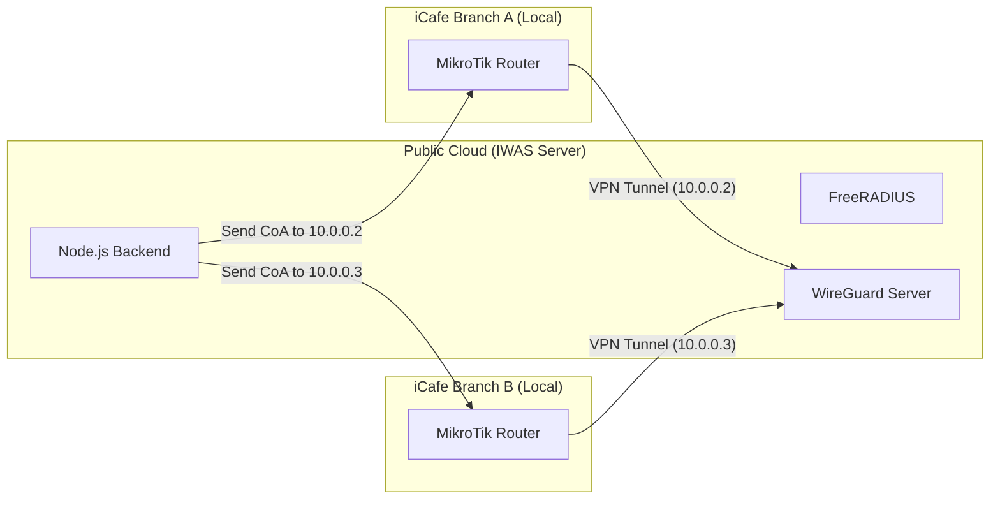

# Network Topology & NAT Traversal

**Section ID:** 04-02  
**Status:** 📝 Documented  
**Last Updated:** February 16, 2026

---

## The Challenge

The IWAS Backend and RADIUS server are hosted on a **Public Cloud (e.g., DigitalOcean, AWS)**. However, the MikroTik routers are located in **Local Branches** behind ISP NAT (Dynamic IPs, Firewalls).

- **Outbound (OK):** Router -> Server (Requests travel out easily).
- **Inbound (The Issue):** Server -> Router (How to send Disconnect/CoA requests to a local IP?).

---

## Technical Strategy: WireGuard VPN Tunnel

To ensure secure, low-latency, and reliable 2-way communication, IWAS uses a **Site-to-Site VPN** architecture.

### 1. Topology Diagram

---

## Control Plane vs. Data Plane

It is critical to understand what travels through the VPN and what doesn't to ensure network performance.

### 📶 Control Plane (Travels thru VPN)

**Purpose:** System management and security.

- **RADIUS packets:** Access-Request, Access-Accept, Accounting-Updates.
- **CoA requests:** Disconnect-Request (Force logout).
- **Health Checks:** Heartbeats from the Router to the Backend.
- **Bandwidth:** Very low (kbps).
- **Security:** Fully encrypted by WireGuard.

### 🌐 Data Plane (NEVER travels thru VPN)

**Purpose:** User internet experience.

- **Web traffic:** YouTube, Facebook, Gaming, Downloads.
- **Gateway:** Traffic goes directly from the Router to the Local ISP (FPT/VNPT).
- **Bandwidth:** High (Maximum speed of the branch's internet line).
- **Benefit:** Zero latency overhead from the central server.

---

## The Handshake Process

1. **User Connects:** Request sent from MikroTik `10.0.0.2` (VPN IP) to RADIUS `10.0.0.1`.
2. **Authorize:** RADIUS replies to `10.0.0.2`.
3. **Browsing:** User data flows out via `ether1-wan` of the router, bypassing the tunnel.
4. **Force Logout:** Backend sends CoA to `10.0.0.2`. The router receives it instantly because the tunnel is persistent.

---

## Failure Scenarios

| Scenario            | Impact                                           | Mitigation                                       |
| ------------------- | ------------------------------------------------ | ------------------------------------------------ |
| VPN Tunnel Drops    | New users cannot login.                          | Keep-alive settings in WireGuard (every 25s).    |
| VPN Tunnel Drops    | Existing users stay online (depending on cache). | Router can fallback to local mode if configured. |
| Central Server Down | System-wide outage for new logins.               | High-availability (HA) cluster for the Backend.  |

---

## Virtual Local Network Recognition

How the Public FreeRADIUS server "recognizes" a local router across the internet:

### 1. The VPN Gateway

The WireGuard interface on the Server acts as a virtual gateway. All traffic coming through this interface is assigned a trusted internal IP (e.g., `10.0.0.x`).

### 2. Client Identification

Instead of identifying routers by their volatile Public IPs, FreeRADIUS uses the **Fixed VPN IP**:

- **Router Q1:** Always `10.0.0.2`
- **Router Q7:** Always `10.0.0.3`

### 3. Request Flow

1. **MikroTik:** Sends UDP Auth packet to `10.0.0.1`.
2. **Server OS:** Receives the packet via the `wg0` interface.
3. **FreeRADIUS:** Sees a request from `10.0.0.3`. It checks its `clients.conf` and finds a matching entry for `10.0.0.3` with the name "District 7".
4. **Validation:** Identity is confirmed without ever needing a local server at the branch.

### 4. Why No Local Server is Needed?

The VPN tunnel effectively "stretches" the local network of the server to every branch. As long as the tunnel is up, the RADIUS server perceives the remote router as being physically connected to the same switch.

---

## How it Works

### 1. Persistent Connection

Each MikroTik router acts as a **WireGuard Client**. Upon startup, it establishes a persistent tunnel to the IWAS Server.

### 2. Private IP Mapping

Each branch is assigned a static internal IP within the VPN range (e.g., `10.0.0.x`).

- `iCafe District 1`: `10.0.0.2`
- `iCafe District 7`: `10.0.0.3`

### 3. Transparent Communication

When the Backend needs to send a **Disconnect-Request (CoA)**, it doesn't try to find the branch's public IP. It simply sends the packet to the internal VPN IP of that router.

---

## Provisioning with VPN

When a Super Admin registers a new location in the UI:

1. The Backend generates a **WireGuard Private/Public Key pair** for that location.
2. The Backend assigns a static **VPN IP** to that `LocationID`.
3. The generated **Setup Script** for the MikroTik includes the WireGuard configuration.

---

## Advantages of this Approach

1. **No Port Forwarding:** No need to open insecure ports on the local router.
2. **Fixed Addressing:** Routers have stable IPs in the eyes of the Server, even if their ISP IP changes every hour.
3. **Encryption:** All RADIUS traffic (which might contain sensitive data) is encrypted through the VPN tunnel.
4. **Bypass Carrier NAT:** Works perfectly even on 4G/5G connections or strict corporate firewalls.

---

## Fallback Method (API Polling)

In rare cases where VPN is blocked, the system can fallback to **Long Polling** via the MikroTik API, but this is less efficient for real-time disconnections.

---

## Related Documents

- [Router Provisioning Workflow](../../08-workflows/router-provisioning.md)
- [System Architecture](./system-architecture.md)
- [MikroTik Integration](../../09-integrations/mikrotik-routeros.md)

---

[← Back to Architecture](./README.md)
