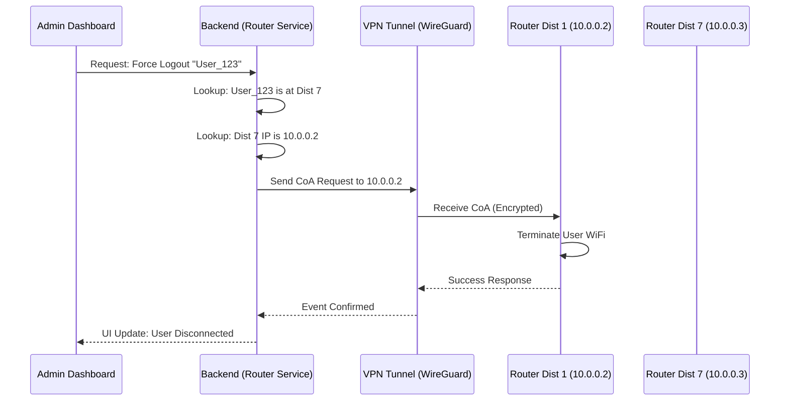

# Router Management & Event Dispatching

**Section ID:** 04-03  
**Status:** 📝 Documented  
**Last Updated:** February 16, 2026

---

## Overview

The **Router Management Service** is the central component of the IWAS Backend responsible for maintaining connections with remote hardware and routing administrative events (Disconnect, Throttling, Status Checks) to the correct location.

---

## 🏗️ Internal Components

### 1. Router Registry (The "Address Book")

The system maintains a persistent map of all registered MikroTik routers.

| Field              | Description                                                       |
| ------------------ | ----------------------------------------------------------------- |
| **NAS-ID**         | Unique hardware identifier (e.g., `icafe-q1`).                    |
| **Location ID**    | Mapping to the physical branch in the database.                   |
| **VPN IP Address** | The static internal IP (e.g., `10.0.0.2`) used for communication. |
| **RADIUS Secret**  | Password for authentication handshake.                            |
| **Status**         | Current health: `ONLINE`, `DEGRADED`, or `OFFLINE`.               |

### 2. Event Dispatcher (The "Switchboard")

This logic handles outgoing commands from the IWAS system to the hardware.

**Logic Flow:**

1. **Trigger:** An event is generated (e.g., Session Expired, Admin Disconnect).
2. **Context Retrieval:** System identifies the `SessionID` -> `LocationID` -> `Router Info`.
3. **Protocol Selection:**
   - **RADIUS CoA:** Used for high-speed disconnects and speed updates.
   - **MikroTik REST API:** Used for complex configuration changes or rebooting.
4. **Execution:** The command is sent specifically to the `VPN IP` of the target router.

---

## ⚡ Logical Event Routing (Sequence)

---

## 🏥 Health & Maintenance

### Heartbeat Mechanism

To ensure the system always knows which router is reachable:

- **Ping:** Every 60 seconds, the Backend "pings" the VPN IP of each router.
- **Accounting:** If RADIUS accounting packets stop arriving during an active session, an alert is triggered.
- **Latency Monitoring:** If the response time via VPN exceeds 500ms, the location is marked as `DEGRADED`.

### Dynamic Re-routing

If a Router's public IP changes, the **WireGuard Tunnel** automatically repairs itself. The Backend continues to use the same **Internal VPN IP** (`10.0.0.x`), ensuring zero downtime for administrative commands.

---

## Admin Capabilities

Admin can perform the following hardware-specific actions:

- **Force Sync:** Re-push all bandwidth limits to the router.
- **Remote Disconnect All:** Clear all active sessions at a specific location.
- **Router Log View:** Stream MikroTik system logs to the Admin Dashboard for remote debugging.

---

## Security Rules

- **Access Control:** No administrative commands can be sent to a router unless the request is authenticated with a `Super Admin` token.
- **Audit Logging:** Every command sent to a router is logged with: `Timestamp`, `AdminID`, `Action`, `TargetRouter`, and `Result`.

---

## Related Documents

- [Network Topology (VPN Strategy)](./network-topology.md)
- [Router Provisioning (Setup)](../../08-workflows/router-provisioning.md)
- [System Architecture](./system-architecture.md)

---

[← Back to Architecture](./README.md)
