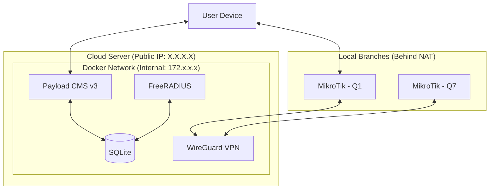

# System Architecture

**Section ID:** 04-02  
**Status:** ✅ Detailed  
**Last Updated:** February 16, 2026

---

## 🏛️ Deployment Topology (Dockerized)

The IWAS system is deployed as a suite of microservices managed by **Docker Compose**. This ensures that the environment is identical across development, staging, and production.

### High-Level Architecture Diagram



---

## 🔄 Component Roles & Interactions

### 1. Payload CMS (The Controller)

- **Role:** Orchestrates the entire system.
- **Outbound:** Sends **CoA (Change of Authorization)** requests to FreeRADIUS via internal Docker network when an Admin terminates a session.
- **Inbound:** Receives **Payment Webhooks** (MoMo/VNPay) and **iCafe-Sync** events (Phase 2).
- **Database:** Writes WiFi credentials and session rules into **SQLite**.

### 2. FreeRADIUS (The Gatekeeper)

- **Role:** Directly interacts with the hardware.
- **Outbound:** Sends Auth-Accept/Reject and Interim-Update ACK to MikroTik routers through the WireGuard tunnel.
- **Database:** Reads credentials from the shared MongoDB instance (using `rlm_mongodb` or `rlm_rest`).
- **Internal:** Listens for CoA triggers from Payload on port `3799`.

### 3. WireGuard (The Secure Bridge)

- **Role:** Acts as the network gateway for remote routers.
- **Routing:** Every MikroTik is assigned a static IP (e.g., `10.0.0.2`). All UDP 1812/1813 traffic is routed through this tunnel, bypassing local firewalls and CGNAT.

### 4. MongoDB (The Shared State)

- **Role:** Single source of truth.
- **Schema:** Managed primarily by **Payload CMS Collections**.
- **Shared Access:** Both Payload and FreeRADIUS access the same database to ensure zero-latency synchronization of sessions.

---

## 🔒 Security Layers

1. **Docker Internal Network:** The Database and RADIUS Backend are not exposed to the public internet. Only ports `80/443` (HTTP) and `51820` (VPN) are open.
2. **Encapsulated Traffic:** RADIUS traffic (which can contain sensitive hashes) never travels over the public internet unencrypted; it is always inside the WireGuard tunnel.
3. **Idempotency:** The architecture uses `idempotency_keys` across all payment and session creation flows to prevent duplicate transactions.

---

## 📊 Monitoring & Observability

To ensure the platform's reliability across hundreds of branches, we implement a centralized logging and monitoring stack.

### 1. Centralized Logging (LOKI Stack)

- **Log Collection:** **Promtail** runs as a sidecar container, scraping logs from Payload CMS, FreeRADIUS, and WireGuard.
- **Log Aggregation:** **Grafana Loki** stores and indexes these logs.
- **Visualization:** **Grafana Dashboard** provides a real-time view of:
  - RADIUS Access-Reject spikes (potential attacks or outages).
  - Failed payment webhooks.
  - VPN tunnel drops.

### 2. Health Heartbeats

- **Router Heartbeat:** The system monitors the `wg0` interface. If a router's internal VPN IP (e.g., `10.0.0.7`) stops responding to pings for > 5 minutes, an alert is triggered.
- **Radius Health:** A periodic "Synthetic Auth" test is performed by the Backend to ensure the RADIUS engine is responding.

---

## 📁 System Folders & Structure

```text
/iwas-platform
├── docker-compose.yml       # Orchestration
├── /apps
│   └── /payload-cms         # Next.js 15 Application
├── /services
│   ├── /freeradius          # Config, Dictionary, and Mods
│   └── /wireguard           # VPN configs & keys
└── /data
    └── /db                  # SQLite database file or persistent volume
```

---

[← Back to Architecture](./README.md)
