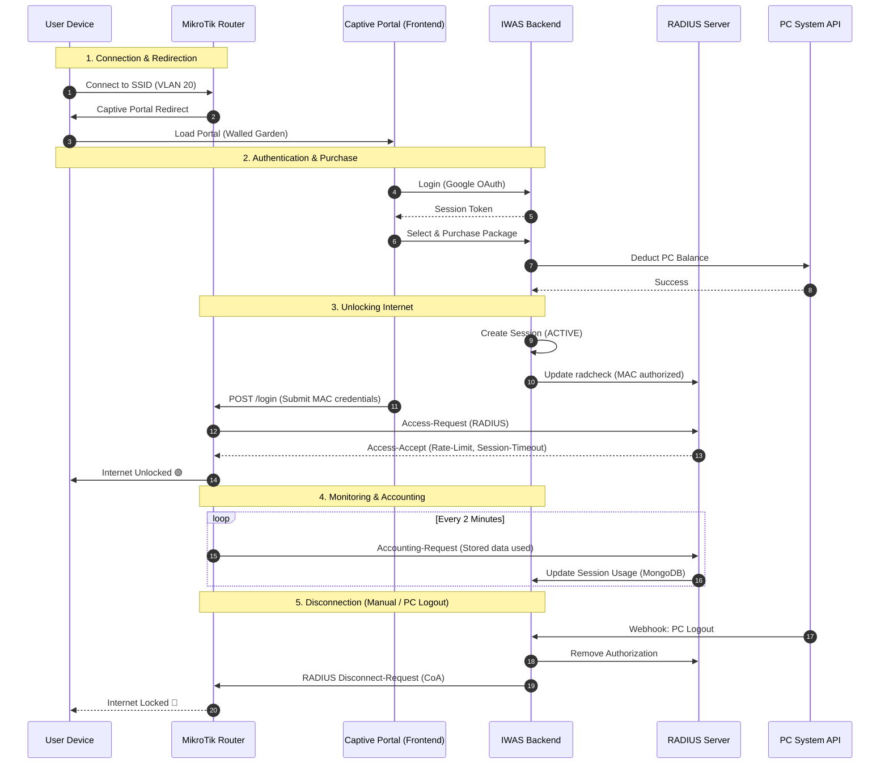

# Router Setup & Integration Workflow

**Feature ID:** WF-02  
**Priority:** P0 (Critical)  
**Status:** 📝 Documented  
**Last Updated:** February 16, 2026

---

## 🔄 System Interaction Sequence

This diagram shows the complete journey from a user connecting to WiFi to the internet being unlocked and eventually terminated.



---

## 🛠️ MikroTik Step-by-Step Setup

Follow these steps to configure your MikroTik router to work with the IWAS system.

### 1. VLAN & IP Setup

Ensure WiFi traffic is isolated from gaming PCs.

```routeros
# Create VLAN 20 for Guest WiFi
/interface vlan add interface=ether1 name=vlan20-wifi vlan-id=20
/ip address add address=192.168.20.1/24 interface=vlan20-wifi
/ip pool add name=wifi-pool ranges=192.168.20.100-192.168.20.254
/ip dhcp-server add address-pool=wifi-pool interface=vlan20-wifi name=dhcp-wifi
```

### 2. RADIUS Client Configuration

Connect the router to our RADIUS server.

```routeros
/radius add address=[IWAS_SERVER_IP] secret=[RADIUS_SECRET] service=hotspot
/radius incoming set accept=yes port=3799
```

### 3. Hotspot Setup

Enable the Captive Portal functionality.

```routeros
/ip hotspot profile
add name=iwas-hsp hotspot-address=192.168.20.1 login-by=http-pap use-radius=yes \
    radius-interim-update=2m dns-name=wifi.icafe.com

/ip hotspot
add interface=vlan20-wifi name=hs-iwas profile=iwas-hsp
```

### 4. Walled Garden (Whitelisting)

Allow users to access the Portal and Payment Gateways before they are authenticated.

```routeros
/ip hotspot walled-garden
add dst-host=wifi.icafe.com
add dst-host=accounts.google.com
add dst-host=api.momo.vn
add dst-host=*.vnpay.vn
```

---

## 🔌 How Admin Controls the Router

When an Admin clicks **"Force Disconnect"** on the IWAS Dashboard, the following technical request is triggered:

### The CoA (Change of Authorization) Request

The Backend (Node.js) sends a UDP packet to the Router's port `3799`.

**Request Content:**

- `Packet Type`: Disconnect-Request (40)
- `Atributes`:
  - `User-Name`: The user's username.
  - `Calling-Station-Id`: The device MAC address.
  - `NAS-IP-Address`: The Router's IP.

**Router Action:**
MikroTik identifies the session matching the MAC address and immediately removes it from the `/ip hotspot active` list, effectively killing the internet connection for that device.

---

## 📈 Accounting & Data Tracking

To show the **"Data Used"** progress bar on the Admin dashboard:

1. MikroTik sends `Interim-Update` packets every 2 minutes (configured in Step 3).
2. RADIUS Server receives these packets and triggers a hook to our Backend.
3. Backend updates the `bandwidth_used` field in the `sessions` collection.

---

## Related Documents

- [MikroTik Integration Guide](../../09-integrations/mikrotik-routeros.md)
- [Session Lifecycle](../../05-features/sessions/session-lifecycle.md)
- [VLAN Isolation](../../05-features/network/vlan-isolation.md)

---

[← Back to Workflows](./README.md)
