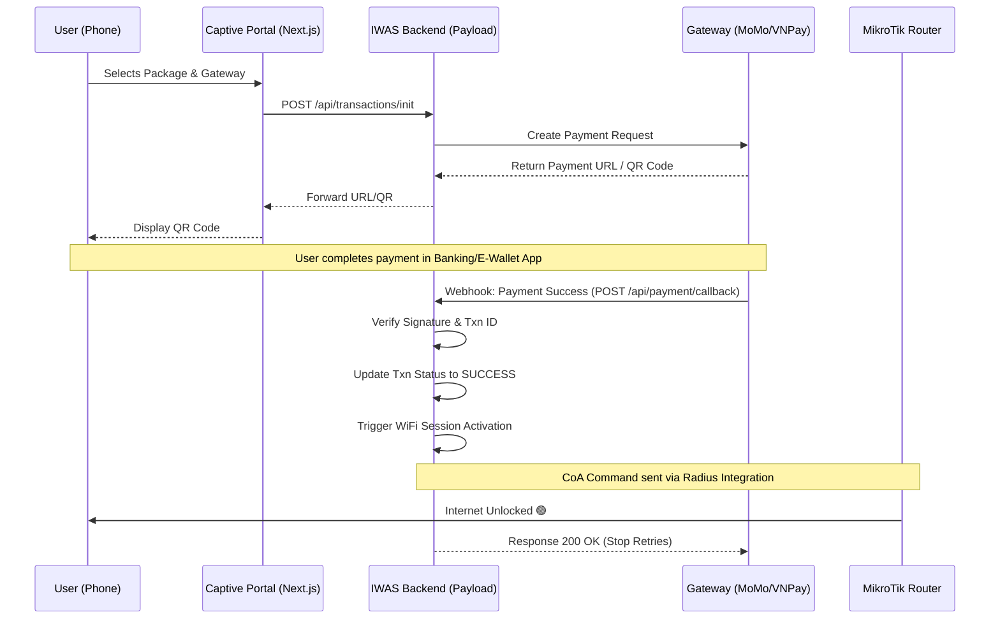

# Payment Processing Workflow

**Workflow ID:** WF-05  
**Priority:** P0 (Critical)  
**Status:** ✅ Detailed  
**Last Updated:** February 16, 2026

---

## 💳 Overview

This workflow details the secure transaction process for External Payment Gateways (MoMo, VNPay, VietQR) within the IWAS platform. It ensures that users are only granted WiFi access _after_ a verified payment confirmation.

---

## 🔄 Transaction Sequence (Async Callback)

Unlike PC Balance payments which are synchronous, external gateways rely on an asynchronous callback (webhook) mechanism.



---

## 🛠️ Implementation Details

### 1. The Callback Payload (Example)

The Backend must expose a public endpoint to receive signed messages from the gateway.

```typescript
// src/endpoints/payment/callback.ts
export const paymentCallback = async ({ req, res }) => {
  const { signature, orderId, amount, resultCode } = req.body;

  // 1. Verify Signature (Security)
  const isValid = verifyHmac(req.body, process.env.PAYMENT_SECRET);
  if (!isValid) return res.status(400).send("Invalid Signature");

  // 2. Idempotency Check
  const transaction = await payload.find({
    collection: "transactions",
    where: { external_id: { equals: orderId } },
  });

  if (transaction.docs[0].status === "SUCCESS") {
    return res.status(200).send("Already Processed");
  }

  // 3. Update Status & Activate
  if (resultCode === 0) {
    // Success
    await activateWifiSession(transaction.docs[0]);
  }
};
```

---

## 🛑 Error Handling & Resilience

### 1. Pending Transaction Timeout

- **Problem:** User creates a QR code but never pays.
- **Solution:** A cleanup job runs every 30 minutes to mark `PENDING` transactions older than 15 minutes as `EXPIRED`.

### 2. Dual Correlation (MAC + OrderID)

Every payment request includes the `device_mac` in the gateway's `extraData` field. This ensures that even if the user closes their browser, the Webhook can still identify which device to unlock.

### 3. Webhook Retries

The Backend must be idempotent. If MoMo sends the same success callback 3 times, IWAS must only activate the WiFi once.

---

## 📁 Related Documents

- [Payment Gateways Integration](../../09-integrations/payment-gateways.md)
- [Authentication Cycle](./authentication-cycle.md)
- [Transaction Management Feature](../../05-features/payments/transaction-management.md)

---

[← Back to Workflows](./README.md)
