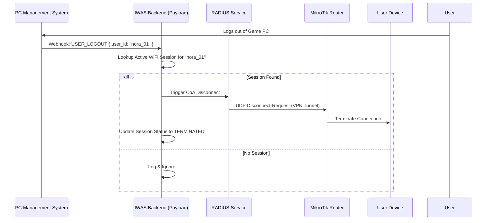

# PC System Integration Workflow

**Workflow ID:** WF-06  
**Priority:** P1 (High)  
**Status:** ✅ Detailed  
**Last Updated:** February 16, 2026

---

## 🎮 Overview

This workflow describes the deep integration between the local iCafe Management System (PC System) and the IWAS Cloud platform. This enables **Wallet Sync**, **Auto-Logout**, and **One-Click WiFi**.

---

## 🔄 Interaction Scenarios

### 1. Wallet Balance Sync (On-Demand)

When a user opens the Captive Portal and logs in via their PC Account:

1. **Frontend:** Requests balance display.
2. **IWAS Backend:** Proxies a request to the local PC System API.
3. **PC System:** Returns current balance in VND.
4. **IWAS Backend:** Displays balance to user (Data is NOT stored in IWAS, only displayed in real-time).

### 2. The "PC-Sync" Logout (Critical Path)

Ensures that WiFi is terminated the moment a user finishes their gaming session.



---

## 🛠️ API Contract (Payload Endpoints)

The IWAS platform exposes a secure endpoint for the PC System:

### POST `/api/pc-sync/event`

**Header:** `X-PC-Secret: <SecurityToken>`

**Payload:**

```json
{
  "event_type": "USER_LOGOUT" | "USER_LOGIN" | "BALANCE_UPDATE",
  "pc_user_id": "string",
  "timestamp": "ISO8601",
  "location_id": "loc_abc"
}
```

---

## 🔒 Security & Reliability

1. **Static IP Whitelisting:** The IWAS Backend only accepts `pc-sync` events coming from known iCafe Branch Public IPs (if available) or verified WireGuard IP ranges.
2. **Signature Verification:** Each request from the PC System is signed with a shared secret key (pre-computed during Branch Setup).
3. **Queueing:** Logout events are placed in a Redis queue (optional) to ensure that if the RADIUS server is busy, the logout command is retried until success.

---

## 📁 Related Documents

- [PC System API Integration](../../09-integrations/pc-system-api.md)
- [Session Lifecycle](./session-lifecycle.md)
- [Network Setup Workflow](./network-setup-workflow.md)

---

[← Back to Workflows](./README.md)
