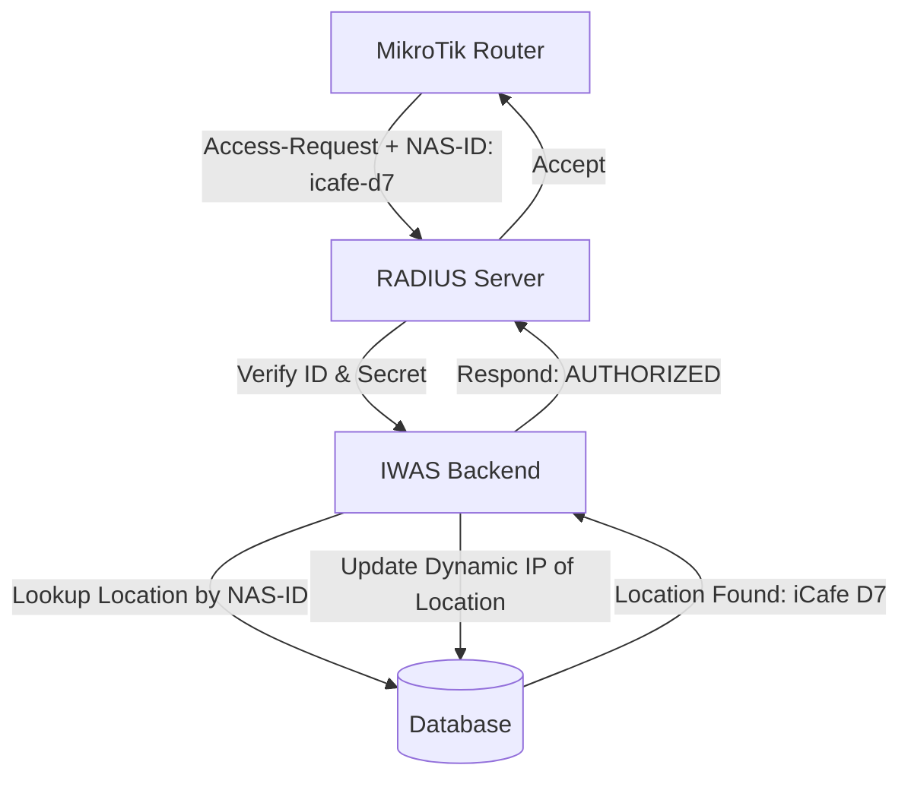

# Router Provisioning Workflow (Khai báo thiết bị)

**Workflow ID:** WF-03  
**Priority:** P0 (Critical)  
**Status:** 📝 Documented  
**Last Updated:** February 16, 2026

---

## Overview

This workflow describes how a **Super Admin** adds a new hardware location (Router) to the system using the Admin UI and how the system establishes a secure connection with that hardware.

---

## Step-by-Step Provisioning

### Phase 1: Registration on Admin UI (Super Admin)

1. **Access Location Manager:** Navigate to `Admin Dashboard > Locations`.
2. **Create Entry:** Click `Create New Location`.
3. **Identity Setup:**
   - **Name:** Enter a friendly name (e.g., "iCafe District 7").
   - **NAS Identifier:** Choose a unique slug (e.g., `icafe-d7`). This is the "Username" of the Router.
4. **Security Generation:**
   - The system generates a **RADIUS Shared Secret**.
   - The system generates a **Unique API Token** for REST communication.
5. **Configuration Export:** The UI displays a `MikroTik Configuration Script` pre-populated with these credentials.

### Phase 2: Hardware Setup (Technical Staff)

1. **Connect to Router:** Access the MikroTik router via Winbox or SSH.
2. **Apply Config:** Paste the system-generated script into the Terminal.
   - This script configures the RADIUS server IP, Secret, and NAS-ID.
   - It also enables the REST API and authorizes the IWAS Server IP.
3. **Handshake:** The router sends its first "Status Check" to the Backend.

### Phase 3: Identity Resolution (System)

How the system maps requests to the correct hardware:

---

## Multi-Router Routing Logic

When the Super Admin clicks a button (e.g., "Disconnect User"), the system routes the request as follows:

1. **Action:** Admin clicks "Disconnect" on User `john_doe` who is at `iCafe District 7`.
2. **Lookup:** Backend looks up the `Location` associated with the user's active session.
3. **Retrieval:** Backend gets the **Router IP** and **RADIUS Secret** of `iCafe District 7`.
4. **Execution:** Backend sends the UDP Disconnect-Request specifically to that Router's IP.

---

## Admin UI Features (Super Admin Only)

### 1. Provisioning Wizard

A step-by-step guide for non-technical admins to add locations.

### 2. Auto-Discovery (Phase 2)

If a new router sends a RADIUS request with a valid ID but unknown IP, the system automatically prompts the Super Admin:

> 🔔 **New Hardware Detected:** A router with ID `icafe-d7` is calling from IP `115.7.x.x`. Do you want to authorize this connection?

### 3. Remote Reboot/Status

Ability to see if the hardware is online (Heartbeat status).

---

## Implementation Rules

- **NAS-ID** must be unique system-wide.
- **Shared Secrets** must be complex and stored encrypted.
- **Dynamic IP Support:** The system must update the stored IP of the location whenever a valid RADIUS packet or API call is received from a known NAS-ID.

---

## Related Documents

- [Location Management Feature](../../05-features/admin/location-management.md)
- [MikroTik Setup Workflow](./network-setup-workflow.md)
- [System Architecture](../../04-architecture/system-architecture.md)

---

[← Back to Workflows](./README.md)
