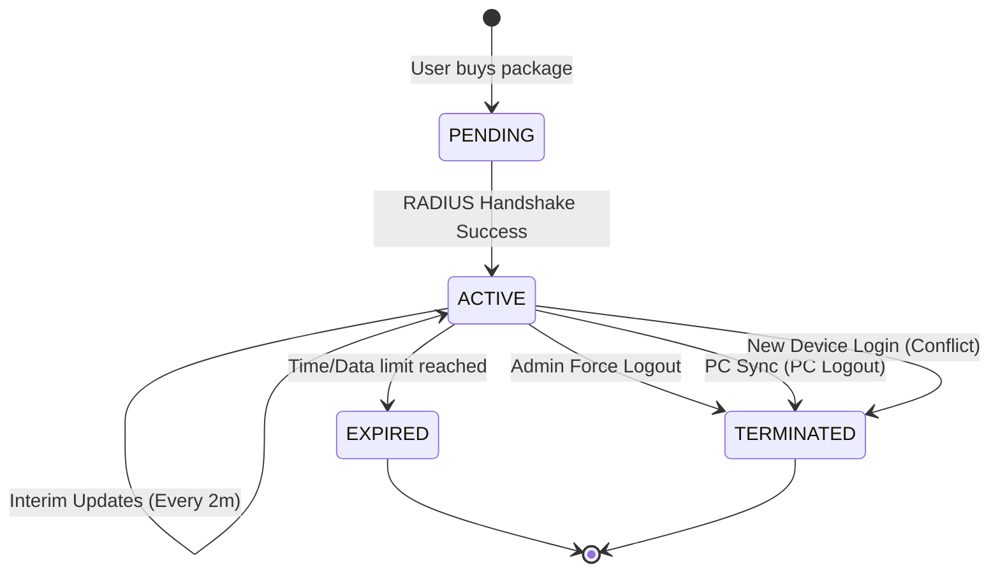

# Session Lifecycle & PC Sync Workflow

**Workflow ID:** WF-07  
**Priority:** P1 (High)  
**Status:** ✅ Detailed  
**Last Updated:** February 16, 2026

---

## ⏳ The Life of a WiFi Session

A session isn't just "On" or "Off". It has a lifecycle that ensures bandwidth is only used by active, paying customers.

### 1. Birth: Activation

- Triggered by `WF-01: Package Purchase Flow`.
- Status: `ACTIVE`.
- Network: MikroTik queue created, Firewall bypass enabled.

### 2. Monitoring: Interim Updates

- Every 2-5 minutes, the MikroTik sends an **Accounting Interim Update** to the RADIUS server.
- The Backend receives this and updates the `data_used` field in the database.
- **Why:** If the router loses power, we still know exactly how much data the user used until that point.

### 3. Synchronization: The PC-Sync Hook

This is the "Killer Feature" for iCafe integration.

1. **User Logs Out of Game PC:** The PC system sends a Webhook to IWAS.
2. **Analysis:** Backend finds the WiFi session associated with that PC User.
3. **Action:** Backend sends a CoA `Disconnect-Request` to the Router.
4. **Effect:** WiFi is cut immediately when they stop playing. No "loopholes" for free internet.

---

## 🛑 Termination Scenarios

### Scenario A: Time Expiration (Normal)

- **MikroTik Side:** When the `Session-Timeout` timer hits zero, the router kills the connection.
- **RADIUS Side:** Sends an `Accounting-Stop` packet to the server.
- **Backend:** Marks session as `EXPIRED`.

### Scenario B: Data Cap Reached (Normal)

- **Check:** Every interim update, the Backend checks if `data_used > data_limit`.
- **Termination:** If exceeded, Backend sends a Disconnect-Request (CoA).

### Scenario C: Manual Force Logout (Admin)

- Admin clicks button -> Backend sends CoA -> Session ends instantly.

### Scenario D: Concurrent Login Conflict

- If a user has a "1 Device Limit" and tries to log into a 2nd device:
- **Rule:** Backend sends CoA to the _old_ device before authorizing the _new_ one. (Auto-switch).

---

## 🔄 State Machine Diagram

---

## 📁 Related Documents

- [Authentication Cycle](./authentication-cycle.md)
- [PC System Integration Guide](../../09-integrations/pc-system-api.md)
- [Session Monitoring Feature](../../05-features/admin/session-monitoring.md)

---

[← Back to Workflows](./README.md)
